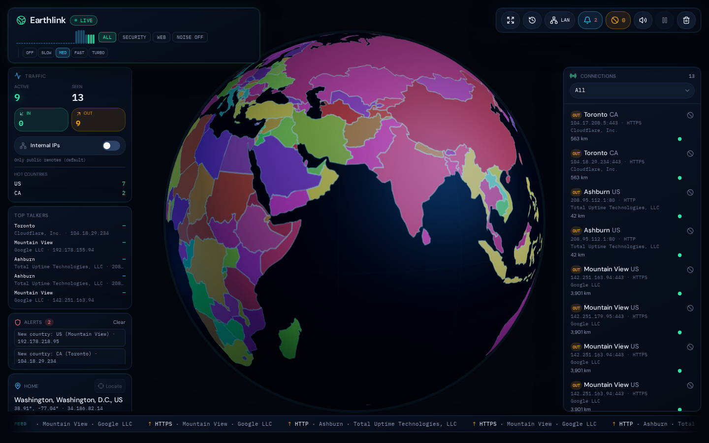
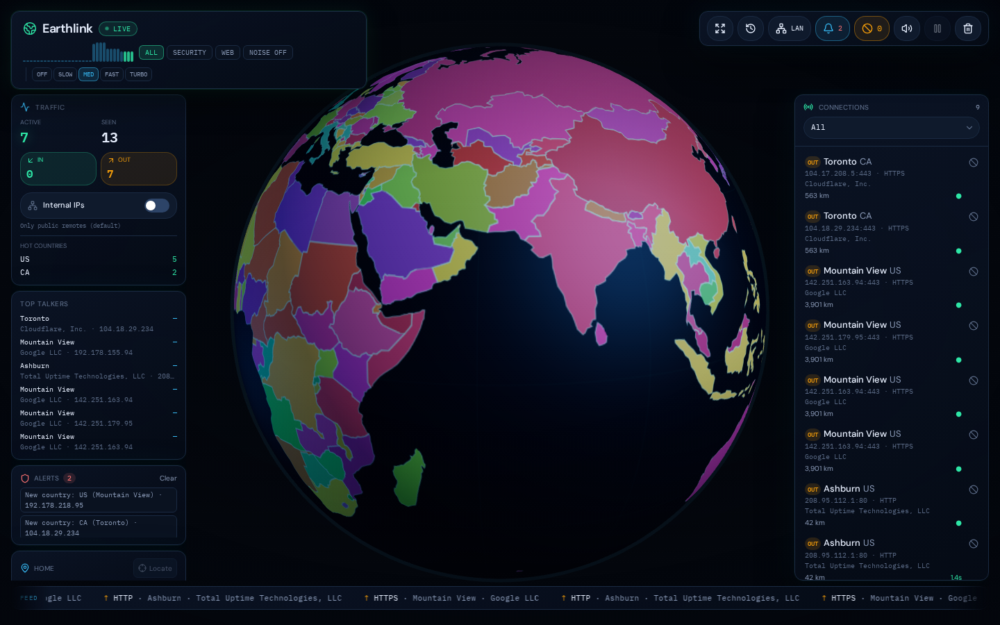
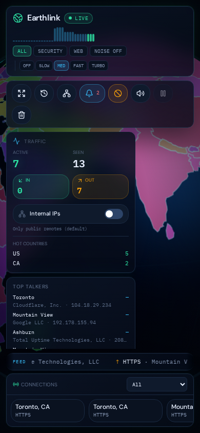

# Earthlink

**Live remote connections on a rotating political globe — NOC-grade.**

Self-host on your server: every public TCP / UDP / DNS / ping peer lights up as a pin and arc to your home location, hangs around, then fades. Inbound is green, outbound is amber.

<p align="center">
  
</p>

| Desktop | Mobile |
| --- | --- |
|  |  |

---

## Layout

| Zone | Content |
| --- | --- |
| **Top-left** | Brand, LIVE, sparkline, security presets, **globe spin** (Off → Turbo) |
| **Top-right** | Kiosk · replay · LAN · alerts · mute · sound · tools (hover tooltips) |
| **Left stack** | Traffic (+ **Internal IPs** toggle) · Top talkers · Alerts · Home · Muted |
| **Right** | Full-height **Connections** + filter |
| **Bottom** | Auto-scrolling **feed marquee** (no scrollbar; pause on hover) |
| **Center-bottom** | Focus card when a connection is selected |

Kiosk mode strips chrome for wall / TV use.

---

## Features

- **Real host traffic** — `/proc/net/tcp`, UDP, conntrack (DNS / ping)
- **Inbound + outbound** — green in, amber out
- **Process names** — `ss -p` / inode map
- **ASN / org** on focus + talkers
- **Bandwidth-weighted arcs** + **heat trails**
- **Security presets** — All · Security · Web · Noise off
- **Globe spin presets** — Off · Slow · Med · Fast · Turbo (saved in browser)
- **Internal / LAN IPs** — toggle under Traffic; private peers plot near home
- **Mute IPs** — hide DNS forwarders; toggle back on
- **Replay scrubber** — recent open/close events
- **Alerts** — new country, SSH from new /24
- **Marquee feed** — auto-scrolls; hover to pause
- **Tooltips** on toolbar, presets, and controls
- **Top talkers** · access-log correlate · iface filter

---

## Quick start

```bash
git clone https://github.com/Og1Kenobi/earthlink.git
cd earthlink
npm install
npm run build
HOST=0.0.0.0 PORT=8080 npm start
```

Open `http://YOUR_SERVER:8080` — badge should read **LIVE**.

Full install: **[INSTALL.md](./INSTALL.md)**

### Optional power-ups

```bash
export EARTHLINK_MUTE_IPS=8.8.8.8,8.8.4.4
export EARTHLINK_INCLUDE_PRIVATE=1          # start with LAN on
export EARTHLINK_ACCESS_LOG=/var/log/nginx/access.log
export EARTHLINK_IFACES=eth0,wg0
export EARTHLINK_HOST_ID=edge-1
HOST=0.0.0.0 PORT=8080 npm start
```

### DNS / ping

```bash
sudo apt install -y conntrack
echo 'YOUR_USER ALL=(root) NOPASSWD: /usr/sbin/conntrack' | sudo tee /etc/sudoers.d/earthlink-conntrack
sudo chmod 440 /etc/sudoers.d/earthlink-conntrack
```

---

## Controls (UI)

| Control | What it does |
| --- | --- |
| **All / Security / Web / Noise off** | Filter which connection types you care about |
| **Off · Slow · Med · Fast · Turbo** | How fast the globe rotates |
| **Internal IPs** (Traffic panel) | Show 10.x / 192.168.x / etc. near home |
| **LAN** (toolbar) | Same as Internal IPs |
| **Ban / Muted** | Hide noisy peers (e.g. DNS forwarders) |
| **Feed** (bottom) | Auto-scrolls; hover to pause |

---

## API

| Path | Description |
| --- | --- |
| `GET /api/traffic` | Live snapshot |
| `GET /api/traffic/history` | Replay events |
| `GET /api/traffic/health` | Health |
| `GET/POST /api/traffic/mute` | Mute list |
| `GET/POST /api/traffic/settings` | `{ "includePrivate": true }` |
| `GET /api/traffic/stream` | SSE |

---

## Dev

```bash
npm install && npm run dev
npm run build && npm start
npm run typecheck
```

Stack: React 19, Vite, TanStack Start, Three.js / R3F, Tailwind v4.

Screenshots: [`docs/screenshots/`](./docs/screenshots/).
